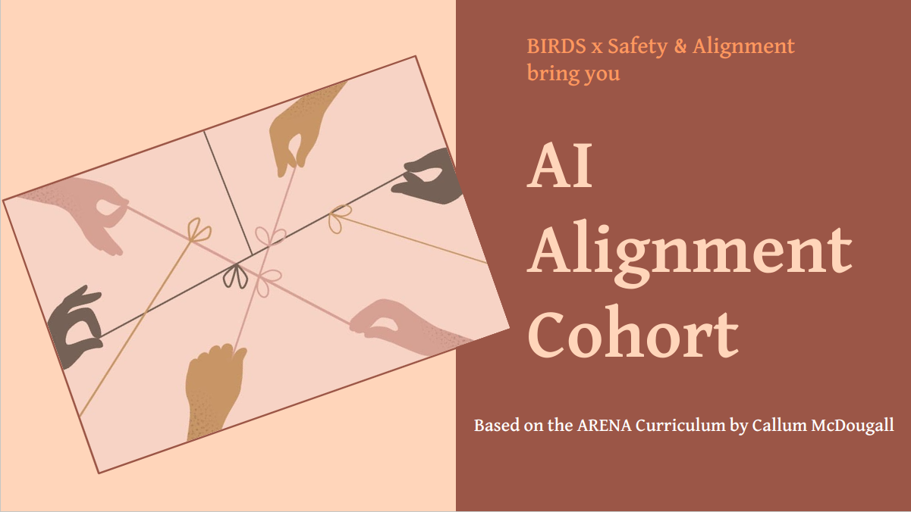

# BIRD AI Alignment Cohort (ARENA) 2024 

This is the repository complementing the AI Alignment Cohort from [BIRD (Cohere For AI Community)](https://share.hsforms.com/10OrjljwpQ52ILJA6ftENIwch5vw).
The [ARENA course curriculum](https://mango-ambulance-93a.notion.site/ARENA-Virtual-Resources-7934b3cbcfbf4f249acac8842f887a99) is specifically designed by Callum McDougall, drawing heavily from other reputed alignment resources.

Special thanks to the [BIRD (Cohere For AI Community)](https://share.hsforms.com/10OrjljwpQ52ILJA6ftENIwch5vw).

This repository is for AI-Alignment-Cohort, a collection of pre-reads, session recordings, and assignments.

# AI Alignment Cohort Sessions

| **Session No.** | **Topic**                                 | **Date** | **Prereads**                                   |
|-----------------|-------------------------------------------|----------|------------------------------------------------|
| 0               | Introduction                              | 7/16     | [Link](https://docs.google.com/presentation/d/1ll53KOAQ_jhoj9N98mYr-bppNNUi-jUcjUoZBs89w20/edit#slide=id.p1) |
| 1               | Linear Algebra and Information Theory     | 7/15     | [Link](https://docs.google.com/document/d/1Nr7jeJpbwRpgdBdUMAKTw4ynjBvFiPKJiOvfm895fEQ/edit)                  |
| 2               | Probability and Statistics                | 7/19     | [Link](https://docs.google.com/document/d/1Q4XFpT7m_i-u4C1BAklYWHnukGks-bnHBQnRixNXe2k/edit)                  |
| 3               | Neural Networks and EINOPS                | 7/22     | [Link](https://docs.google.com/document/d/1py92rMuEvWAzonvVrtZ0YwPJ5dq9YFCJKJYQoCKqm98/edit)                  |
| 4               | CNNs, ResNets and Ray Tracing             | 8/02     | [Link](https://docs.google.com/document/d/1qTVTbDBrtTWFWdVMKS3uf5J7RBb-UWZEztu8Lt0OA_c/edit)                  |

## Session Recordings

- **Session 0: Introduction** 
  - Recording: [Link](https://sites.google.com/cohere.com/c4ai-community/community-programs/birds/ai-alignment-cohort)
  - Further Reading: [TBA](#)
- **Session 1: Linear Algebra and Information Theory** 
  - Recording: [Link](https://sites.google.com/cohere.com/c4ai-community/community-programs/birds/ai-alignment-cohort)
  - Further Reading: [TBA](#)
- **Session 2: Probability and Statistics** 
  - Recording: [Link](https://sites.google.com/cohere.com/c4ai-community/community-programs/birds/ai-alignment-cohort)
  - Further Reading: [TBA](#)
- **Session 3: Neural Networks and EINOPS** 
  - Recording: [Link](https://sites.google.com/cohere.com/c4ai-community/community-programs/birds/ai-alignment-cohort)
  - Further Reading: 
    - [This tutorial covers einops in more detail w/ more complex operations](https://einops.rocks/1-einops-basics/)
    - [And this is a comprehensive blog post on einsum (einsum is all you need)](https://rockt.github.io/2018/04/30/einsum)
- **Session 4: CNNs, ResNets and Ray Tracing** 
  - Recording: [Link](https://sites.google.com/cohere.com/c4ai-community/community-programs/birds/ai-alignment-cohort)
  - Further Reading: [TBA](#)

